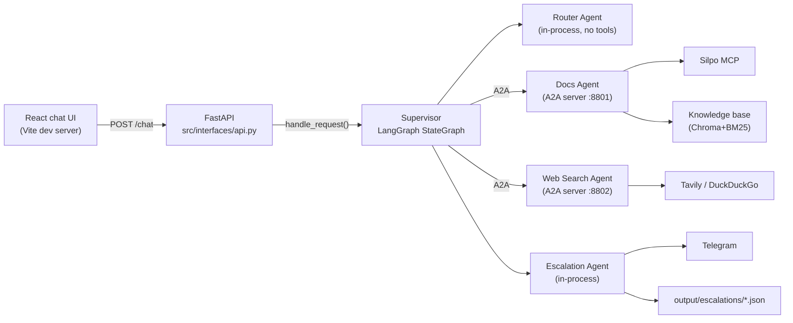
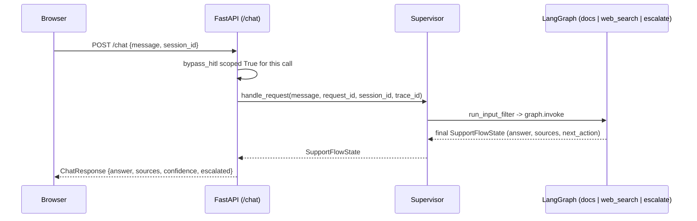

# SupportFlow

A read-only, multi-agent customer-support assistant. A LangGraph Supervisor
classifies an incoming customer message, routes it to a Docs, Web Search, or
Escalation agent, and returns a sourced answer or hands the case to a human
operator via Telegram.

## Architecture

Router and Escalation agents run in-process with the Supervisor. Docs and
Web Search agents run as separate A2A servers. The React chat UI talks only
to the FastAPI API (`src/interfaces/api.py`) — CORS restricted to the local
frontend origin, no direct browser access to any agent or external service.



When a case escalates (critical category, low confidence, or a tool
failure), Escalation Agent writes a file report and notifies a human
operator through a Telegram bot — a one-way delivery, with no return path
from Telegram back into the system.

## Usage scenario

Open the Vite dev server's own printed URL (default `http://localhost:5173`)
for the chat UI. `POST /chat`'s request/response sequence:



## Setup

```bash
python -m venv .venv
.venv/Scripts/pip install -r requirements.txt -r requirements-dev.txt
cp .env.example .env   # fill in OpenRouter, Silpo MCP, Tavily, Telegram, Langfuse keys
git config core.hooksPath hooks   # mirrors the evaluation sets to Langfuse on commit
```

One-time, manual (Silpo's OAuth is phone+OTP against a real account, not
automatable):

```bash
python scripts/silpo_mcp_login.py
```

One-time, manual — verify the Telegram bot/channel config
(`TELEGRAM_BOT_TOKEN`/`TELEGRAM_CHAT_ID`):

```bash
python -m scripts.telegram_bot_setup_check
```

Then, three processes, three terminals:

```bash
python -m src.interfaces.launcher
```

```bash
.venv/Scripts/uvicorn src.interfaces.api:app --reload --port 8000
```

```bash
cd frontend && npm install && npm run dev
```

## Gate

```bash
black --check . tests/*.py && flake8 && mypy src && pytest --cov=src
```

`pytest --cov=src` never makes a live call to Silpo MCP, Tavily,
OpenRouter, or Telegram — `scripts/docs_agent_smoke.py`,
`scripts/run_router_gate.py`, and `scripts/escalation_agent_smoke.py` are
the manual, live-verification paths.

Escalation Agent sends a real Telegram message only with
`ALLOW_REAL_SEND=true`.

## Diagrams

`report/` carries the project's diagram documentation — each `.html` is a
self-contained page (inline SVG plus a prose walkthrough) with a matching
standalone `.svg` export:

- `architecture.html` — the full system: React UI → FastAPI → Supervisor →
  A2A to Docs/Web Search, or direct Escalation; Langfuse from all three
  processes.
- `supervisor-graph.html` — the LangGraph inside Supervisor: Router and
  Escalation as real nodes, Docs and Web Search as thin A2A call-outs.
- `router-sequence.html` — Router's single classification call and its
  retry-then-fail-closed policy.
- `escalation-sequence.html` — Escalation's compose → mask → confirm →
  dedup → write → send pipeline.
- `docs-agent-sequence.html` — Docs Agent's hybrid retrieval (Chroma+BM25)
  and Silpo MCP call sequence.
- `web-search-agent-sequence.html` — Web Search Agent's Tavily-then-
  DuckDuckGo fallback sequence.
- `langfuse-observability.html` — what reaches Langfuse and how one
  customer request becomes a single trace across three processes.
- `prompt-architecture.html` (+ `prompt-*.svg`) — the structure of each of
  the five system prompts (Router/Docs/Web Search/Escalation/Supervisor).
