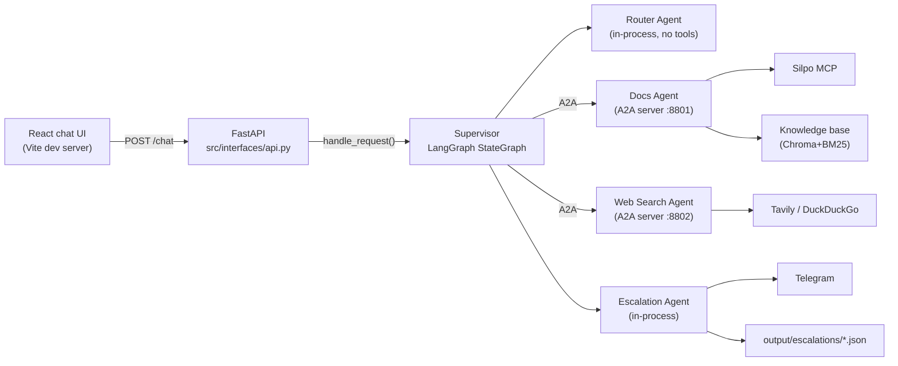
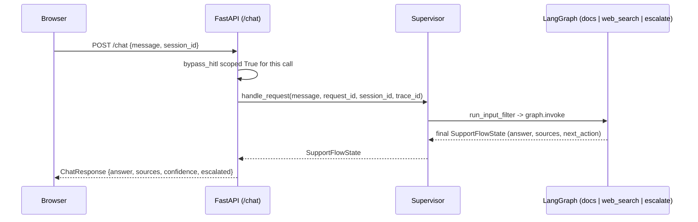

# SupportFlow

A read-only, multi-agent customer-support assistant. A LangGraph Supervisor
classifies an incoming message, routes it to a Docs, Web Search, or
Escalation agent, and returns a sourced answer or hands the case to a human
operator via Telegram.

See `docs/task-supportflow.md` for the full task statement and
`docs/requirements-checklist.md` for what "done" means.

## Progress

| | Stage | What it delivers |
|---|---|---|
| ✅ | 0 — Kickoff | Conventions, layer table, dependency pins, real Silpo MCP tool list + allowlist, seeded prompts |
| ✅ | 1 — Core | Pydantic schemas, LangGraph StateGraph, Supervisor, Router Agent, input filter, fail-closed retry policy, Router gate ≥10/12 |
| ✅ | 2 — Data | Docs Agent + RAG (Chroma+BM25), real Silpo MCP client (persistent token, 17-tool allowlist), Web Search Agent (Tavily+ddgs), A2A server/client, launcher |
| ✅ | 3 — Escalation | Escalation Agent, file report, Telegram notification |
| ✅ | 4 — Evaluation & observability | Wave A (Observability) live-verified: Langfuse/OTel tracing across the full path, `CallbackHandler`, per-observation metadata, cross-process trace propagation via Langfuse's own `TraceContext`. Known gap: Telegram's own observation unconfirmed (needs an `ALLOW_REAL_SEND=true` run). Wave B done and live-verified, 2026-08-26: 18-case golden dataset (`evals/golden_dataset.json`), DeepEval metrics (Answer Relevancy, Faithfulness, Route/Tool Correctness, Privacy Safety, custom GEval Support Resolution Quality), thresholds set from a real baseline, a Docs Agent meta-prompting cycle (production→candidate, +0.112 mean, promoted), and a full `deepeval test run tests/test_golden_dataset.py -m eval` gate — see `docs/decisions.md` #51-60 for every defect found and fixed along the way |
| ✅ | 5 — Product & docs | FastAPI (`src/interfaces/api.py`), React 19 (Vite) chat UI, final README, diagrams |

Updated at the close of every stage — see `docs/decisions.md` for the
reasoning behind each stage's scope.

## Architecture

Router and Escalation agents run in-process with the Supervisor. Docs and
Web Search agents run as separate A2A servers. The React chat UI talks only
to the FastAPI API (`src/interfaces/api.py`) — CORS restricted to the local
frontend origin, no direct browser access to any agent or external service.
See `docs/decisions.md` §1 for why, and `CLAUDE.md` for the Clean
Architecture layer table this repository follows.



### Telegram's role: one-way operator notification, not a customer channel

Telegram is never a second conversation surface the customer talks to — the
customer's only touchpoint is the chat UI. When Supervisor escalates a
request (critical category, low confidence, or a tool failure — task §7),
Escalation Agent writes a structured report to
`output/escalations/{session_id}/{request_id}.json` and, with
`ALLOW_REAL_SEND=true`, sends the same case as one Telegram message to a
human operator's own channel — symmetric to the file report, just delivered
instantly. There is no return path from Telegram back into the system; an
operator acts outside it.

Verified live, 2026-08-26 (real browser → `/chat` → real Telegram send, one
message, `ALLOW_REAL_SEND` toggled on for this one confirmed test and back
off immediately after — see the runtime toggle below): a critical-category
message produced a real Telegram delivery and a single Langfuse trace
(`6cf3318d017f4ccc86b3d911ca51e2a2`) containing both `report_writer.write`
and `telegram.send_message` as real, error-free observations.

`/chat`'s response tells the browser what actually happened, not just that
a case escalated — `report_written`/`telegram_sent` reflect
`EscalationAgentResult.written`/`.sent` directly (a deduplicated or
capped escalation still sets `escalated: true` without writing or sending
anything, so this is never inferred from `escalated` alone). The chat UI's
header also carries a runtime toggle (`POST /admin/real-send`) for
`ALLOW_REAL_SEND` — flip it on for one live-verified send, back off
afterward, without restarting the API process (task §8's own optional
"Settings page" extension).

## Setup

```bash
python -m venv .venv
.venv/Scripts/pip install -r requirements.txt -r requirements-dev.txt
cp .env.example .env   # fill in OpenRouter, Silpo MCP, Tavily, Telegram, Langfuse keys
```

One-time, manual (Silpo's OAuth is phone+OTP against a real account, not
automatable — docs/decisions.md #5):

```bash
python scripts/silpo_mcp_login.py
```

One-time, manual — Escalation Agent's Telegram bot and test channel
(`docs/telegram_bot_setup.md` walks through creating the bot, adding it to
a test group, and finding `TELEGRAM_CHAT_ID`):

```bash
python -m scripts.telegram_bot_setup_check
```

Then, three processes, three terminals:

```bash
python -m src.interfaces.launcher
```

```bash
.venv/Scripts/uvicorn src.interfaces.api:app --reload --port 8000
```

```bash
cd frontend && npm install && npm run dev
```

Open the Vite dev server's own printed URL (default `http://localhost:5173`)
for the chat UI. `POST /chat`'s request/response sequence:



## Gate

```bash
black --check . tests/*.py && flake8 && mypy src && pytest --cov=src
```

`pytest --cov=src` never makes a live call to Silpo MCP, Tavily,
OpenRouter, or Telegram (docs/decisions.md #21) — `scripts/docs_agent_smoke.py`,
`scripts/run_router_gate.py`, and `scripts/escalation_agent_smoke.py` are
the manual, live-verification paths.

Escalation Agent sends a real Telegram message only with
`ALLOW_REAL_SEND=true` — see `docs/telegram_bot_setup.md` for the one-time
bot/test-channel setup needed before that flag means anything.

## What this system can and cannot do

**Can, verified live:** classify a customer message and route it to the
right specialist; answer product questions grounded in the real Silpo
catalogue (Silpo MCP) and an internal knowledge base, with sources; answer
general questions grounded in real web search results; refuse a
prompt-injection attempt and a system-prompt-leak attempt; escalate a
critical or low-confidence case to a human operator with a written report
and, when enabled, a real Telegram delivery — the whole path traced end to
end in Langfuse with a real LLM-as-judge score per answer.

**Cannot, by design, not by omission:** write anything to Silpo (cart,
favorites, certificates, orders) — task §1's read-only invariant, enforced
in code, not just prompted. Hold a second live request per agent process
while the first is still composing — Docs/Web Search Agent process one
request at a time (`docs/decisions.md` #20's accepted trade-off); a second
message sent before the first finishes will fail its own agent-card probe,
not queue.

**Response time is a sum of four real terms, not "the network":**
measured live 2026-08-26 — 12.5s once every part is warm, up to ~40s on a
cold path. In order of size: OpenRouter's own generation time (10–30s,
un-avoidable — the process is blocked on the provider's HTTP response);
Silpo MCP's own branch/delivery/timeslot bootstrap, four sequential calls
on the *first* product search of a process and one call (cached) on every
search after; Docs Agent's one-time `sentence-transformers` cold start
(~940MB RSS, `docs/decisions.md` #7); and the single-request-at-a-time
limit above. `config/models.yaml`'s `docs`/`web_search` timeouts were
raised from the original `30s` to `75s` on this measurement, after the
tighter bound was found live to be abandoning agents that were still
answering correctly and escalating them as a false `technical failure` —
not a search or MCP defect (both re-verified healthy: 8/8 probed product
terms returned real catalogue prices).

## Known risks

- Generation-span cost is never populated — Langfuse doesn't recognise
  the OpenRouter-routed model id for its automatic cost calculation;
  token counts are real.
- PII masking at the Langfuse export barrier covers email/phone/card
  shapes only, not OAuth tokens, API keys, or free-text addresses.
- Escalation's send-dedup/cap store is a single-process, in-memory
  dict — correct for this project's single-process demo topology, not a
  multi-worker deployment.
- The final golden-dataset gate is not fully green yet (Stage 4 Wave
  B): known route-boundary flakiness and two below-floor answer-quality
  findings remain, tracked and not silently dropped.
- `/chat` has no authentication — CORS restricted to the local frontend
  origin is the only access control, matching task §8's own scope (a local
  demo, not a hosted deployment).
- `session_id` is generated client-side and kept in the browser's
  `sessionStorage` — it dedups Escalation's per-session cap within one
  browser tab against one running API process instance; the underlying
  store (`escalation_agent.py`'s `_session_store`) is a single-process,
  in-memory `dict` with no eviction, same scope limitation as the row
  above.
