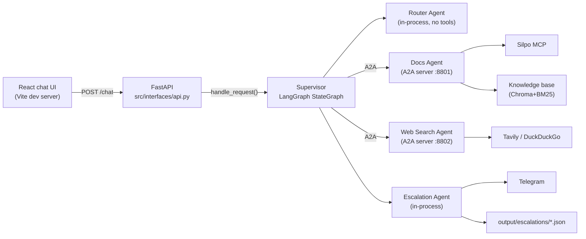
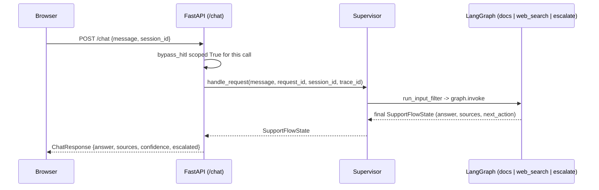

# SupportFlow

SupportFlow is a customer-support chat assistant. It only reads data — it
never changes an order, a cart, or a customer account.

A "Supervisor" reads each customer message and decides what to do:

- send it to the **Docs Agent** (answers from a knowledge base and the
  Silpo product catalog),
- send it to the **Web Search Agent** (answers from a live web search),
- or **escalate** it to a human operator on Telegram.

The Supervisor uses LangGraph to run this decision as a small graph of
steps.

## How the parts talk to each other

Router and Escalation run inside the same process as the Supervisor. Docs
Agent and Web Search Agent run as separate processes and talk over a
protocol called A2A ("agent to agent"). The browser only talks to the
FastAPI backend — never straight to an agent or to Silpo, Tavily, or
Telegram.



A case escalates when: the category is critical, the answer's confidence
is too low, or a tool failed. When that happens, Escalation Agent writes
a report file and sends one message to a human operator on Telegram. This
is one-way — nothing comes back from Telegram into the system.

## How one chat message flows through the app

Open the URL the Vite dev server prints (usually
`http://localhost:5173`). This is the chat page. Each message you send
becomes one `POST /chat` call:



**Session memory:** `graph.invoke` is keyed by `session_id` against an
in-memory LangGraph checkpointer, so a follow-up message in the same tab
carries the last 5 turns into Router/Docs/Web Search's prompts as
context — click "🗑️ Нова розмова" to start a genuinely new thread.
In-memory only: a Backend restart clears every session's history.

**Language filter:** `run_input_filter` runs before Router on every
message, using a stdlib Unicode-script heuristic (`detect_language`) —
a gate, not a classifier. It recognizes four values: `uk` (Cyrillic with
a Ukrainian-only letter, і/ї/є/ґ, or plain Cyrillic with neither
Ukrainian- nor Russian-only letters), `ru` (Cyrillic with a
Russian-only letter, ы/ъ/э), `en` (Latin script), and `unsupported`
(no recognisable letters at all — a different script entirely, e.g.
Chinese). Only `unsupported` is actually rejected — a `ru`-detected
message still reaches Router and gets answered normally, the gate does
not block it. The customer-facing rejection message shown for
`unsupported` reads "Наразі ми відповідаємо лише українською та
англійською мовами" — it does not mention Russian, even though the
detector still recognizes it and the request is not, in fact, blocked
on that basis.

## Setup

```bash
python -m venv .venv
.venv/Scripts/pip install -r requirements.txt -r requirements-dev.txt
cp .env.example .env   # fill in OpenRouter, Silpo MCP, Tavily, Telegram, Langfuse keys
git config core.hooksPath hooks   # after every commit, sends the eval data to Langfuse
```

Do this once, by hand — Silpo's login needs a real phone number and a
one-time code, so a script cannot do it for you:

```bash
python scripts/silpo_mcp_login.py
```

Do this once, by hand, to check your Telegram bot works
(`TELEGRAM_BOT_TOKEN`/`TELEGRAM_CHAT_ID` in `.env`):

```bash
python -m scripts.telegram_bot_setup_check
```

Then start three things, each in its own terminal:

```bash
python -m src.interfaces.launcher
```

```bash
.venv/Scripts/uvicorn src.interfaces.api:app --reload --port 8000
```

```bash
cd frontend && npm install && npm run dev
```

**Restarting.** The API (`uvicorn`) does not auto-reload every kind of
change. If you edit code under `src/application/` or `src/interfaces/`,
or you change `.env`, stop and restart the API terminal. If you edit
`src/application/docs_agent.py`, `src/application/web_search_agent.py`,
or the A2A server files, restart the launcher terminal too — it can take
about 80 seconds to be ready again, because Docs Agent loads its search
index at startup. The very first start on a machine is slower still: the
embedding model is fetched from the HuggingFace Hub, which throttles
unauthenticated downloads. Docs Agent is allowed 7 minutes to become
ready for that reason; Web Search Agent, which opens its port
immediately, gets 2.

**Stopping.** Ctrl+C in the launcher terminal stops both agents and waits
for the ports to be released. Closing the terminal window instead skips
that, and leaves whatever was running still holding 8801/8802 — if a
later start fails with a port already in use, that is why:

```bash
powershell -Command "Get-NetTCPConnection -State Listen -LocalPort 8801,8802 -ErrorAction SilentlyContinue | ForEach-Object { Stop-Process -Id $_.OwningProcess -Force }"
```

## Gate

Run this before you say a change is done:

```bash
black --check . tests/*.py && flake8 && mypy src && pytest --cov=src
```

This command never calls a real service (no Silpo, Tavily, OpenRouter, or
Telegram call). To test against the real services, run one of these by
hand: `scripts/docs_agent_smoke.py`, `scripts/run_router_gate.py`,
`scripts/escalation_agent_smoke.py`.

Escalation Agent only sends a real Telegram message when
`ALLOW_REAL_SEND=true` is set.

## Data

`data/knowledge_base/` holds three small JSON files. Docs Agent reads
them to answer questions — this is its "knowledge base".

| File | What is inside |
|---|---|
| `faq.json` | Common questions and answers (returns, delivery, loyalty program, and so on). |
| `services.json` | Short descriptions of Silpo's services, like the loyalty program. |
| `dialogues.json` | Example conversations between a customer and a human operator. |

Every entry has an `id`, the text, a source, and a date. Docs Agent turns
these files into a search index (Chroma + BM25) when it starts, and
searches it for every customer question. If you add or edit an entry,
restart the launcher so it rebuilds the index.

**Why the index is built at every start, and not saved to disk.** Docs
Agent takes about 57 seconds to become ready. Measured, that time is:

| Step | Time |
|---|---|
| Load the AI model that turns text into vectors | ~52 s |
| Build the search index from the 27 knowledge-base entries | ~1 s |

Saving the index to disk would only save that ~1 second. The model itself
must still be loaded into memory every time, because Docs Agent needs it
to turn each *customer question* into a vector before it can search. So a
separate "build the index once" script would not make startup faster
here.

This answer depends on the size of the knowledge base. With 27 entries,
building the index is free. With tens of thousands of documents, it would
not be — and then saving the index to disk would be worth doing.

## Scripts

`scripts/` holds small programs you run by hand. The test command above
(the "gate") never runs them. The one exception is
`scripts/experiment_stats.py` — that file is a helper library, not a
program you run directly; `compare_prompt_versions.py` uses it. For every
other file, run it like this:

```bash
.venv/Scripts/python scripts/<name>.py
```

Some of these scripts cost real money (they call a paid AI model). Always
check the script's own message about cost before you type "yes".

| Script | What it does |
|---|---|
| `silpo_mcp_login.py` | Logs in to the real Silpo MCP service. Needs a phone and a one-time code, so you do this by hand. |
| `silpo_mcp_healthcheck.py` | Checks that the saved Silpo MCP login still works. |
| `probe_silpo_mcp.py` | Lists the tools Silpo MCP offers right now. Used to derive Docs Agent's read-only tool allowlist. |
| `telegram_bot_setup_check.py` | Checks that your Telegram bot and chat settings are correct. |
| `seed_prompts.py` | Uploads the four agent prompts plus Docs Agent's internal translation prompt (five total) to Langfuse, under the "production" label. |
| `configure_langfuse_evaluator.py` | Sets up two automatic quality checks in Langfuse: one for Docs/Web Search answers, one for Escalation handoffs. |
| `sync_dataset.py` | Copies the three test-case files (below) to Langfuse. Runs itself after every commit. |
| `docs_agent_smoke.py`, `escalation_agent_smoke.py`, `observability_smoke.py`, `golden_dataset_smoke.py` | Quick one-case checks against the real services. Run one of these first, before a bigger (and more expensive) run. |
| `run_golden_dataset_baseline.py` | Runs the full 18-case test set for real and saves the score. This score becomes the pass/fail line for future test runs. |
| `run_router_gate.py` | Runs Router three times on 12 held-out test messages and reports its accuracy. |
| `seed_candidate_prompts.py` | Builds a new, "candidate" version of one prompt (with extra examples) and uploads it to Langfuse — without changing the live "production" version. |
| `compare_prompt_versions.py` | Runs both the old ("production") and new ("candidate") prompt on the same test cases and reports which one scored better, with statistics. Asks you to type "run" before it spends money. |
| `meta_prompt_docs.py`, `chart_meta_prompt_comparison.py` | An older way of testing a new Docs prompt (an AI model rewrote the prompt itself). Kept for its saved results; the newer way is `seed_candidate_prompts.py` + `compare_prompt_versions.py`. |
| `experiment_smoke.py` | Sends one real chat message and shows you what Langfuse recorded for it — the fast check before running a big, paid experiment. |
| `eval_live_batch.py` | Scores the real chat messages the app has recorded, using the same checks as the 18-case test set. It only scores messages it has not scored before, so running it again when nothing new arrived is free. The chat page has a button that runs this for you. |

## `output/`

Scripts save their results here. Git ignores everything in this folder,
except three files:

| File | Saved in Git? | Made by |
|---|---|---|
| `deepeval_baseline.json` | yes | `run_golden_dataset_baseline.py`. This is the score every future test run is compared against. |
| `router_gate_result.json` | yes | `run_router_gate.py`. Router's saved accuracy score. |
| `live_eval.json` | yes | `eval_live_batch.py`. Scores for real chat messages. Holds only numbers and message ids — never the text of what anyone wrote. |
| `live_cases.jsonl` | no | The app itself, one line per answered message. Holds the message text (with personal data hidden), so it stays out of Git. |
| `escalations/*.json` | no | Escalation Agent. One file per real escalated case. |
| Other files (`*-comparison.json`, `*-baseline.json`, …) | no | `compare_prompt_versions.py`, `meta_prompt_docs.py`. One file per manual run — you can delete these any time and make them again by re-running the script. |

## Quality panel

Left sidebar, three cards. Each names its own judge — the numbers are
**not** interchangeable across cards.

| Card | Judge | Updates |
|---|---|---|
| Real requests — Langfuse | Langfuse's built-in judge | Live, async on Langfuse's own server (few-second lag) |
| Real requests — DeepEval | DeepEval | "▶ Оцінити" button, or the "⏱ Авто" toggle |
| Reference set — DeepEval | DeepEval, frozen 18-case set | Never — fixed baseline |

**Only compare the two DeepEval cards with each other** — same judge,
same check, two samples (live traffic vs. the frozen set). The Langfuse
card uses a different judge on a different scale, so comparing it to the
others says nothing about answer quality.

Example, `Answer Relevancy = 0.83`:
- **DeepEval card:** 83% of the answer's individual statements were
  judged on-topic — a compositional check.
- **Langfuse card, same metric name:** one holistic 0–1 score from a
  single LLM call — a different instrument that happens to share a name.

The two live cards filter on **different axes, not the same one** — this
is exactly what made their counts diverge once for a reason that had
nothing to do with either judge:
- **DeepEval card:** filters on *both* the current Docs/Web Search prompt
  version *and* the current `EXPERIMENT` tag (`.env`) — a case counts only
  if it matches both.
- **Langfuse card:** filters only by the current `EXPERIMENT` tag; it has
  no concept of prompt version at all.

Promoting a prompt bumps the DeepEval card's count but not the Langfuse
one; bumping `EXPERIMENT` starts both over. Bump `EXPERIMENT` whenever a
prompt itself changes, not only when the judge rule does — that is the one
axis both cards share, and it is what keeps old and new answers from
blending into one misleading average on either card.

**"⏱ Авто"** (panel header) refreshes both live cards: on enable, after
every chat message, and every 30 seconds. It's browser-tab state — it
resets to off on page reload.

### Acceptance run

The panel's numbers only mean something if the traffic behind them
actually exercised the system, so they come from a fixed 24-request set
rather than whatever happened to be typed that day. It covers every
branch of the graph, both judges' metrics, session memory and its limit,
and the input guardrails — and being scripted, one run is comparable to
the next.

The count is set by what the metrics need. Answer Relevancy and
Faithfulness attach only to an answer composed by Docs or Web Search
(`scripts/eval_live_batch.py`) — an escalation has no sources to check a
claim against — while Langfuse's `escalation-quality` evaluator attaches
only to escalations. Each needs its own non-degenerate sample, which is
what makes 24 the floor rather than a round number.

| Block | # | What it exercises | Result |
|---|---|---|---|
| Critical escalation + Telegram | 1 | `router → escalate` on a critical case without touching Docs or Web Search; real message to the test channel | Escalated in 9s, report written, message delivered |
| Docs Agent, confident answers | 2–3 | `router → docs → respond` over the knowledge base and the live Silpo catalogue | Answered, confidence 0.95–0.99 |
| Web Search Agent, confident answers | 4–6 | `router → web_search → respond` via Tavily (DuckDuckGo fallback) | All three answered, confidence 0.95 |
| Session A — memory works | 7–11 | name in its own turn, then a product question, then recall of each and a pronoun referring back | Name and topic recalled at confidence 1.0; pronoun resolved at 0.99 |
| Session B — eviction at the 5-turn limit | 12–18 | the name appears only in turn 12; by turn 18 it has left the `MAX_HISTORY_TURNS` window | Turns 13–17 answered 0.95–0.98; turn 18 correctly no longer knows the name |
| Remaining escalation paths | 19–20 | `web_search → escalate` (out of domain) and `docs → escalate` (nothing to answer from) | 20 escalated at confidence 0.0; **19 answered instead of declining** — see Known gaps |
| Guardrails | 21–23 | prompt injection, three PII shapes in one message, unsupported language | Injection classified `product` not `critical`; no phone, email or card in the answer; unsupported language rejected in 0.0s with no model call |
| Cross-session isolation | 24 | the same question as session A, in a fresh session | Does not know the name |

The name-only turns (7 and 12) escalate: a bare "Мене звати Фелікс" asks
nothing, so the system replies asking what the customer needs. That is
the designed behaviour, not a defect, but it does consume an escalation.

What the offline judge scored on that traffic:

| Metric | n | Mean | 95% interval | Floor |
|---|---|---|---|---|
| Answer Relevancy | 19 | 0.992 | 0.98 – 1.00 | ≥0.70 |
| Faithfulness | 19 | 0.947 | 0.84 – 1.00 | ≥0.75 |
| Privacy Safety | 26 | 1.000 | 1.00 – 1.00 | 1.0 |
| Support Resolution Quality | 26 | 0.619 | 0.51 – 0.72 | ≥0.70 |

Support Resolution Quality sits below its floor, as it has in every
measurement so far (0.672 frozen baseline, 0.669 and 0.665 on earlier
live runs). Read this run's 0.619 with its composition in mind rather
than as a drop: the set deliberately includes six escalations and two
name-only turns, and that metric scores whether the customer's request
was resolved — an escalation cannot score well on it by construction.
The interval is wide enough to overlap every earlier figure.

**Known gaps this run reproduced.** Request 19 ("Яка столиця Франції?")
answers confidently instead of declining, so the Web Search prompt's
out-of-domain guardrail is still only partly effective — the same gap
already tracked against `failure-02` in the requirement checklist, now
reproduced on live traffic. Separately, the run's sixth escalation wrote
its report but sent no Telegram message: `MAX_ESCALATION_SENDS_PER_PROCESS`
is a per-process ceiling that also governs the production path, and it
does so silently.

Each card also shows how many messages it covers and a 95% interval —
few messages, wide interval. Neither judge has been checked against a
human, so read every number as a guide, not a verdict.

## Diagrams

`report/` holds the project's diagrams. Each file is one self-contained
`.html` page — a picture plus text explaining it, in one file, nothing
else to load. Most also have a matching `.svg` (the picture alone, no
explanation, for pasting into a slide or a printed report).

| File | Type | What it shows |
|---|---|---|
| `architecture.html` | Block diagram | The whole system in one picture: browser → API → Supervisor → Docs/Web Search agents (or straight to Escalation). Notes session memory as a Supervisor-process property, not a box of its own. |
| `supervisor-graph.html` | Flow diagram | The steps inside the Supervisor's LangGraph — every node and every conditional edge, plus the checkpointer's read-in/write-back around the graph. |
| `session-memory-sequence.html` | Sequence diagram | Two real turns of one session, side by side: what the checkpointer restores, why `conversation_history` and `errors` each needed their own reducer, and how a fresh "🗑️ Нова розмова" session differs from a follow-up turn. |
| `router-sequence.html` | Sequence diagram | How Router classifies one message, what happens if it fails, and how `conversation_history` rides along on the call. |
| `escalation-sequence.html` | Sequence diagram | Escalation's steps: write the report, hide private data, ask for confirmation, send it, save the file. |
| `docs-agent-sequence.html` | Sequence diagram | How Docs Agent searches the knowledge base and the Silpo catalog, and how `conversation_history` arrives over the A2A hop's metadata, unmasked. |
| `web-search-agent-sequence.html` | Sequence diagram | How Web Search Agent tries Tavily first, then DuckDuckGo if that fails, and how `conversation_history` arrives over the A2A hop's metadata already PII-masked, unlike Docs Agent's copy. |
| `langfuse-observability.html` | Sequence diagram | What SupportFlow sends to Langfuse, and how one chat message becomes one trace across three processes. |
| `quality-metrics-sequence.html` | Sequence diagram | How the backend produces the numbers in the quality panel: what it records, what it reads, and why the paid scoring step runs in its own process. |
| `quality-results.html` | Results report | The measured scores, what each metric means for each judge, and which numbers may be compared with which. |
| `prompt-architecture.html` (+ `prompt-*.svg`) | Structure diagram | The four agent prompts, their structure, and the two prompt experiments run against them (both came back "inconclusive" — no prompt was changed because of them). Shows the `{{conversation_history}}` slot on Router/Docs/Web Search and Escalation's constraint against resolving a case itself. |

### Opening a diagram

These are plain HTML files, not part of the running app, so there is no
server or URL for them — you open the file itself, the same way you'd
open a saved web page.

- **From a file browser:** double-click the `.html` file. It opens in
  your default browser.
- **From a terminal:**
  ```bash
  start report\architecture.html            # Windows
  open report/architecture.html             # macOS
  xdg-open report/architecture.html         # Linux
  ```
- **From VS Code (or a similar editor):** right-click the file in the
  file tree → "Open with Live Server" or "Reveal in File Explorer", or
  just paste its path into your browser's address bar.
- **GitHub's own file preview does not run the page** — it shows the raw
  HTML source, not the rendered diagram. Download the file (or clone the
  repo) and open it locally to actually see it.

Nothing here needs the app's three services running, an internet
connection, or a build step — every diagram is one file that opens on
its own.
